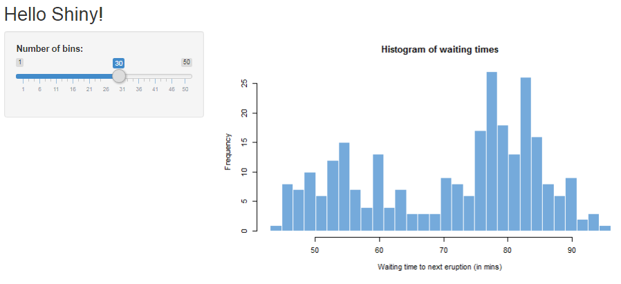
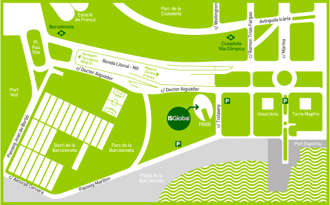

# Creating Shiny Apps for biostatisticians and bioinformaticians

Repository with the material corresponding to the course __Creating Shiny Apps for biostatisticians and bioinformaticians__ given at 
[ISGlobal](http://www.isglobal.org) (former CREAL). Each folder contains slides, R code, data and exercises of each topic.


## License
 
Unless otherwise stated, all material is licensed under a
[Creative Commons Attribution-ShareAlike 3.0 License](http://creativecommons.org/licenses/by-sa/3.0/).
This means you are free to copy, distribute and transmit the work,
adapt it to your needs as long as you cite its origin and, if you do
redistribute it, do so under the same license.

# Introducción y Objetivos
[Shiny](http://shiny.rstudio.com) es un paquete del programa [R](http://www.r-project.org/) desarrollado por [RStudio](http://www.rstudio.com/) que permite crear páginas webs dinámicas sin que sea necesario ningún conocimiento de HTML ni de Javascript o PHP, y se basa únicamente en código R.

Gracias a Shiny se pueden construir y personalizar de manera rápida y sencilla interfaces gráficas sobre páginas web con pocas líneas de código. De esta manera, es fácil compartir funciones escritas en R con otros usuarios no familiarizados con él y que quieran usarlas de manera interactiva, o sea, "cliqueando" en lugar de tener que escribir los comandos. Por ejemplo, grupos que no disponen de programadores, bioinformáticos y/o bioestadísticos.

# Dirigido a
Estudiantes, profesores e investigadores que utilizan R en su trabajo diario, con escaso o nulo conocimiento de HTML, PHP o Javascript y quieran aprender a crear interfaces gráficas dinámicas sobe páginas web. 

# Metodología del curso
El curso será eminentemente práctico. La temática se irá introduciendo mediante ejemplos. Al final de cada bloque (cada 2 o 3 horas) se propondrá un ejercicio que los alumnos deberán resolver en clase. A lo largo del curso, se irán discutiendo los ejemplos modificando alguno de ellos y dando posibles alternativas para que se asimilen mejor los conceptos. Los alumnos dispondrán de las diapositivas del curso así como el código utilizado tanto en la presentación como para resolver los ejercicios. 

# Fechas y horario
Las fechas del curso son el 13 y 14 de febrero y se realizará en el Instituto de Salud Global Barcelona-Campus Mar (ISGlobal) (www.creal.cat) [antiguo CREAL] situado en el Parque de Investigación Biomédica de Barcelona (www.prbb.org ). El número de plazas para el curso está limitado a 20 y las plazas se adjudicarán ESTRICTAMENTE por orden de llegada de pre-inscripción, rellenando el [formulario de pre-inscripción]( https://docs.google.com/forms/d/e/1FAIpQLSeY0v5l7gbze0CEBlR5gx33A69dyk7uNk4KJZxcE8DtXje-Gw/viewform?usp=sf_link) 

El horario del curso es el siguiente:
Mañanas: de 9:00 a 13:30h / Tardes: de 15:00 a 18:00h

# Temario


**Día 1:**
- Parte I (1 hora) -  Introducción de Shiny y primeros ejemplos.
- Parte II (2 horas) - Disposición de los elementos del formulario: paneles, botones, desplegables,...
- Parte III (2 horas) - Funcionamiento de Shiny.
- Ejercicios (1'5 horas)

**Día 2:**
- Parte IV (2'5 horas) - Técnicas para mejorar el aspecto y la funcionalidad de la aplicación.
- Parte V (2 horas) - Aspectos avanzados.
- Práctica (2 horas) - Creación de una aplicación.

Los ejemplos que se presentarán durante el curso incluirán, entre otros tópicos:

> *	Creación de tablas y gráficos dinámicos.
> *	Parrillas donde introducir datos de forma interactiva.
> *	Confección de cuestionarios para alimentar bases de datos.
> *	Selección de variables de ficheros subidos por el usuario.
> *	Aplicaciones sólo visibles después de introducir un password.

# Material y Requisitos
Las clases se realizarán en un aula del ISGlobal en el que los alumnos deberán traer sus propios portátiles. Dicha aula tendrá acceso WiFi a Internet y los alumnos dispondrán de acceso previo a todo el material del curso que incluye las librerías, el código R y los datos necesarios para seguir las clases y realizar los ejercicios. 

Se recomienda tener el paquete shiny instalado antes de empezar el curso. Para comprobar el correcto funcionamiento, al ejecutar el siguiente código debería lanzarse la aplicación mostrada en la figura de más abajo.

```
library(shiny)
runExample("01_hello")
```




El curso utilizará como herramienta principal Rstudio. Todos los alumnos deberán tener instalado una semana antes del curso la última version de [R](https://cloud.r-project.org/) y de [Rstudio](https://www.rstudio.com/products/rstudio/download/). Durante esa semana anterior al curso, se enviará unas instrucciones para que todos los alumnos tengan una misma configuración y puedan seguir las clases de forma eficiente.

# Organización del curso
El curso está organizado por el Grupo de Bioinformática en Epidemiología Genética (BRGE) (http://brge.isglobal.org) del ISGlobal liderado por Juan R González que ha organizado varias ediciones de cursos similares al que aquí se presenta entre los que destacan la realización de 14 ediciones del curso sobre análisis de datos en estudios de asociación genética o 4 ediciones de cómo crear librerías en R entre otros.

# Profesorado

Isaac Subirana es licenciado en "Ciencias y Técnicas Estadísticas" por la Universitat Politècnica de Catalunya (UPC) y Doctorado en "Estadística" por la Universitat de Barcelona (UB). Desde el 2007, trabaja como profesor asociado en el Departamento de Estadística de la Facultad de Biología de la UB. Además, es Técnico Investigador en el campo de la Epidemiología Cardiovascular en el grupo REGICOR del "Parque de Investigación Biomédica de Barcelona" (PRBB) desde el 2003. Es el creador y responsable del paquete compareGroups de R (www.comparegroups.eu) para el que se implementó una aplicación diseñada a partir de las herramientas de Shiny.


# Coste del curso y forma de pago
El coste del curso es de 290??? que incluye el desayuno que se realizará a mitad de la mañana, así como todo el material del curso en soporte electrónico (funciones, librerías y ejercicios resueltos) las diapositivas y material bibliográfico presentado en las clases.  Los socios del BIB tendrán un descuento del 10% pero sólo a los dos primeros miembros que lo soliciten. El resto si quieren asistir al curso deberán abonar el coste total del curso.

Una vez sea confirmada la inscripción al curso se deberá realizar el pago a través de transferencia bancaria, al número de cuenta CAIXABANK, S.A número ES79 2100 0801 1102 0052 1586. Una vez realizado el ingreso el alumno tendrá que enviar el comprobante de la transferencia a gemma.punyet@isglobal.org.


# Acceso al Campus Mar - ISGlobal (PRBB) 
El Instituto de Salud Global Barcelona (ISGlobal) se encuentra en el Parque de Investigación Biomédica de Barcelona (PRBB) situado en la calle Doctor Aiguader, 88 de Barcelona, en la primera planta del PRBB, delante del Paseo Marítimo de Barcelona, entre el Hospital del Mar y el Hotel Arts de la Villa Olímpica. 

 


Se puede llegar a través de varias vías. Si necesitáis más información podéis consultar la web de Transportes Metropolitanos de Barcelona ( www.tmb.net ).

Paradas de Metro cercanas al centro: Línea 4 (amarilla) Barceloneta y Ciutadella.


